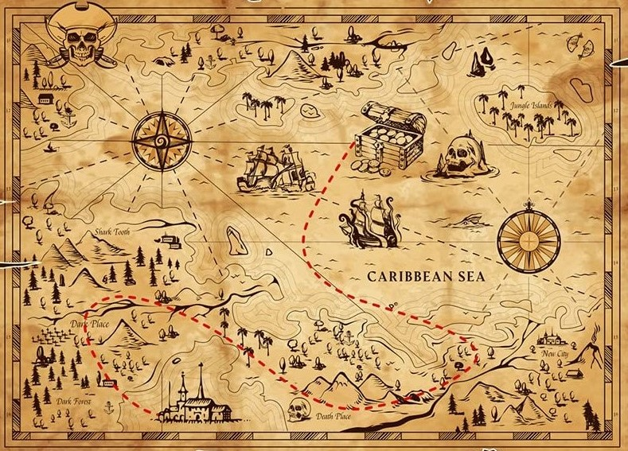

<!-- PROJECT LOGO -->
<br /> <a name="readme-top"></a>
<div align="center">
  <a href=" https://github.com/Kyathirao/tiger-treasure-hunt/">
    
  </a>

<h3 align="center">Tiger Treasure Hunt</h3>

  <p align="center">
    <br />
    Tiger Treasure Hunt is a fun team online game where the players join a video conference (e.g., Zoom or Teams) to play a fun question and answer game in order to solve a series of clues that leads the team to a treasure.
    <br />
    <a href="https://kyathirao.github.io/tiger-treasure-hunt/">Play Tiger Treasure Hunt</a>
  </p>
</div>


<!-- TABLE OF CONTENTS -->
<details>
  <summary>Table of Contents</summary> 
  <ol>
    <li><a href="#about-tiger-treasure-hunt">About Tiger Treasure Hunt</a></li> 
    <li><a href="#built-with">Built With</a></li>
    <li><a href="#getting-started">Getting Started</a></li>
    <li><a href="#installation">Installation</a></li>
    <li><a href="#howtoplay">How to Play</a></li>
    <li><a href="#license">License</a></li>
    <li><a href="#acknowledgments">Acknowledgments</a></li>
    <li><a href="#teamcontributors">Team Contributors</a></li>
    <li><a href="#reflections">Team Reflections</a></li>
  </ol>
</details>


<!-- ABOUT THE GAME -->
## About Tiger Treasure Hunt <a name="about-tiger-treasure-hunt"></a>

The Tiger Treasure Hunt is an online game where the players operate as a team to locate the treasure. The Team lead enters all the answers to solve the puzzles that lead to the next adventure.  Throughout the adventure, morse code will be presented for the team to solve – just to add another challenge! After solving each task, the team will earn another clue to find the treasure.  After solving all the puzzles, the team will have uncovered the treasure and is declared the Tiger Treasure Hunt Winners.

<p align="right">(<a href="#readme-top">back to top</a>)</p>


### Built With <a name="built-with"></a>

Tiger Treasure Hunt is written in NPM & REACT and deployed via the [Tiger](https://github.com/kyathirao/TigerTreasure.github.io) Public GitHub Repository using GitHub Pages.  Prototypes were done using standard HTML/Index/CSS and JavaScript to call external public APIs.  In the end it was determined to be easier to use REACT to accomplish the same results.

* [![npm][npm.js]][npm-url]
* [![React][React.js]][React-url]

<p align="right">(<a href="#readme-top">back to top</a>)</p>


<!-- GETTING STARTED -->
## Getting Started <a name="getting-started"></a>

If you would prefer to play this game from your own device locally.  
To get a local copy up and running follow these simple example steps.

### Installation <a name="installation"></a>

1. Clone the repo
   ```sh
   git clone [https://github.com/kyathirao/TigerTreasure.github.io.git](https://github.com/Kyathirao/tiger-treasure-hunt/)
   ```
2. Install NPM packages
   ```sh
   npm install
   ```

<p align="right">(<a href="#readme-top">back to top</a>)</p>


<!-- Game Play Instructions -->
## How to Play <a name="howtoplay"></a>

1. Schedule a conference video room  (e.g., Zoom or Teams)  for you and a group of friends to play Tiger Treasure Hunt.
2. Join the video conference at the scheduled time to play.
3. The team votes on a Team Leader that will control all of the online play.
4. With the highly popular and revered Team Leader installed, the Team Leader then shares their screen with the rest of the virtual team.
5. The Team Leader then launches the Tiger Treasure Hunt game by ...
6. The game begins by showing a series of locations you must visit and answer a question related to our beloved Clemson Tigers
7. The game only allows the Team Leader to select the next sequential location/clue on the map that is not solved, beginning with clue 1.
8. Once the clue is selected, a question is prompted for the team to discuss and the Team Leader to answer on behalf of the team.  Don't forget to blame the Team Leader should you get the answer wrong.  After all, they entered the answer.
9. As the team successfully answers the questions and solves the clue, they can move to the next sequential location/clue until they reach the end and win the game!
10. Watch out! Throughout the game you will randomly be prompted to solve a morse code clue.  Make sure you study up on morse code!!!
11. Have fun, it's a game!!!!

<p align="right">(<a href="#readme-top">back to top</a>)</p>


<!-- LICENSE -->
## License <a name="license"></a>

Distributed under the MIT License. See `LICENSE.txt` for more information.

<p align="right">(<a href="#readme-top">back to top</a>)</p>

<!-- ACKNOWLEDGMENTS -->
## Acknowledgments <a name="acknowledgements"></a>

* [Treasure Hunt Map](https://www.google.com/url?sa=i&url=https%3A%2F%2Fescapetrails.co%2F5-steps-to-making-a-fun-treasure-hunt%2F&psig=AOvVaw1wrdwGNjpaetxlDkIT-lC3&ust=1698077742486000&source=images&cd=vfe&opi=89978449&ved=0CBMQ3YkBahcKEwig8P3WhoqCAxUAAAAAHQAAAAAQBg)
* []()
* []()

<p align="right">(<a href="#readme-top">back to top</a>)</p>

<!-- Team Members -->
## Team Contributors <a name="teamcontributors"></a>

**CPSC 8710 - Team-Saideep-Kyathi-Ken**

**Due Date: October 23, 2023**

**Team members:**
* Kyathi rao  Kantheti - api’s for games and REACT code
* Saideep Chandrashekar Kondur - flow of game, original in design in python and HTML
* Ken Roulier - GitHub Pages, Repository, prototype HTML, Documentation, Schedule

**Team meeting schedule:**
* 9/7/23  3-3:30pm Team Meeting Room 
* 9/13/23  3-3:45 - Team Meeting 
* 9/20/23  3-3:45 – Team Meeting 
* 9/27/23  3:45-4:15 - Team Meeting 
* 10/4/23  3:45-4:15 – Team Meeting 
* 10/11/23  4:30-5:00 - Team Meeting 
* 10/20/23  4:30-5:00 - Team Meeting 
* 10/23/23 - Project Due Monday at midnight 

<p align="right">(<a href="#readme-top">back to top</a>)</p>

<!-- Team Members -->
## Team Reflections <a name="reflections"></a>

Write a short reflection (around 500 words) on the design and development process. Discuss challenges faced, what worked, what didn't, and lessons learned

<p align="right">(<a href="#readme-top">back to top</a>)</p>


<!-- MARKDOWN LINKS & IMAGES -->
<!-- https://www.markdownguide.org/basic-syntax/#reference-style-links -->
[contributors-shield]: https://img.shields.io/github.com/contributors/kyathirao/tiger-treasure-hunt.svg?style=for-the-badge
[React.js]: https://img.shields.io/badge/React-20232A?style=for-the-badge&logo=react&logoColor=61DAFB
[npm.js]: https://img.shields.io/badge/npm-20232A?style=for-the-badge&logo=npm&logoColor=61DAFB
[React-url]: https://reactjs.org/
[npm-url]: https://npmjs.com/


# Getting Started with Create React App

This project was bootstrapped with [Create React App](https://github.com/facebook/create-react-app).

## Available Scripts

In the project directory, you can run:

### `npm start`

Runs the app in the development mode.\
Open [http://localhost:3000](http://localhost:3000) to view it in your browser.

The page will reload when you make changes.\
You may also see any lint errors in the console.

### `npm test`

Launches the test runner in the interactive watch mode.\
See the section about [running tests](https://facebook.github.io/create-react-app/docs/running-tests) for more information.

### `npm run build`

Builds the app for production to the `build` folder.\
It correctly bundles React in production mode and optimizes the build for the best performance.

The build is minified and the filenames include the hashes.\
Your app is ready to be deployed!

See the section about [deployment](https://facebook.github.io/create-react-app/docs/deployment) for more information.

### `npm run eject`

**Note: this is a one-way operation. Once you `eject`, you can't go back!**

If you aren't satisfied with the build tool and configuration choices, you can `eject` at any time. This command will remove the single build dependency from your project.

Instead, it will copy all the configuration files and the transitive dependencies (webpack, Babel, ESLint, etc) right into your project so you have full control over them. All of the commands except `eject` will still work, but they will point to the copied scripts so you can tweak them. At this point you're on your own.

You don't have to ever use `eject`. The curated feature set is suitable for small and middle deployments, and you shouldn't feel obligated to use this feature. However we understand that this tool wouldn't be useful if you couldn't customize it when you are ready for it.

## Learn More

You can learn more in the [Create React App documentation](https://facebook.github.io/create-react-app/docs/getting-started).

To learn React, check out the [React documentation](https://reactjs.org/).

### Code Splitting

This section has moved here: [https://facebook.github.io/create-react-app/docs/code-splitting](https://facebook.github.io/create-react-app/docs/code-splitting)

### Analyzing the Bundle Size

This section has moved here: [https://facebook.github.io/create-react-app/docs/analyzing-the-bundle-size](https://facebook.github.io/create-react-app/docs/analyzing-the-bundle-size)

### Making a Progressive Web App

This section has moved here: [https://facebook.github.io/create-react-app/docs/making-a-progressive-web-app](https://facebook.github.io/create-react-app/docs/making-a-progressive-web-app)

### Advanced Configuration

This section has moved here: [https://facebook.github.io/create-react-app/docs/advanced-configuration](https://facebook.github.io/create-react-app/docs/advanced-configuration)

### Deployment

This section has moved here: [https://facebook.github.io/create-react-app/docs/deployment](https://facebook.github.io/create-react-app/docs/deployment)

### `npm run build` fails to minify

This section has moved here: [https://facebook.github.io/create-react-app/docs/troubleshooting#npm-run-build-fails-to-minify](https://facebook.github.io/create-react-app/docs/troubleshooting#npm-run-build-fails-to-minify)
